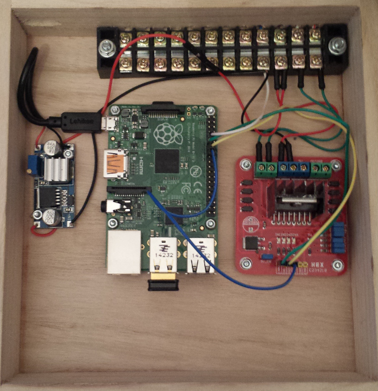
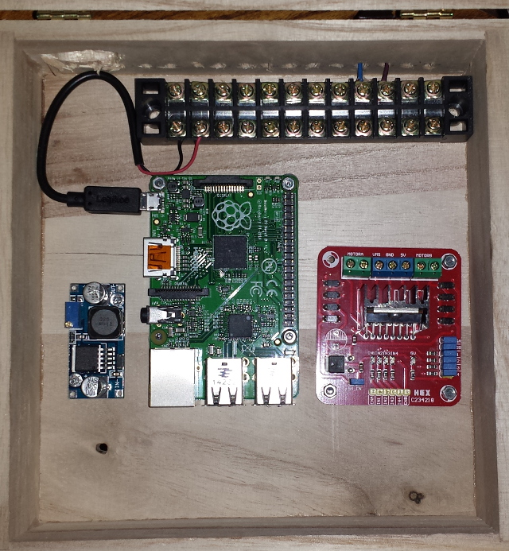
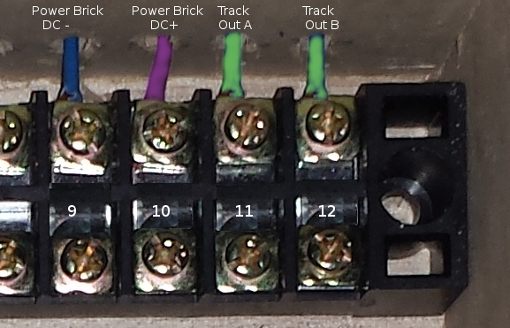
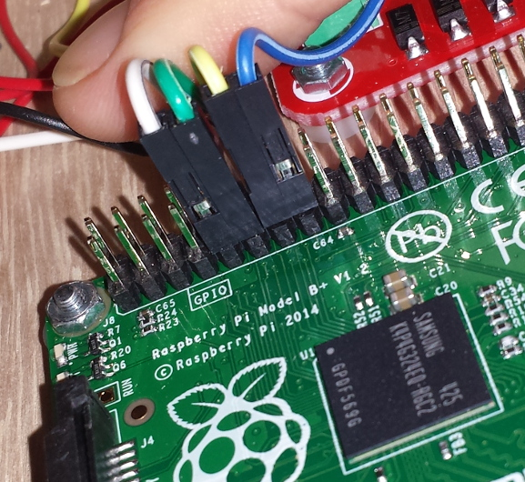
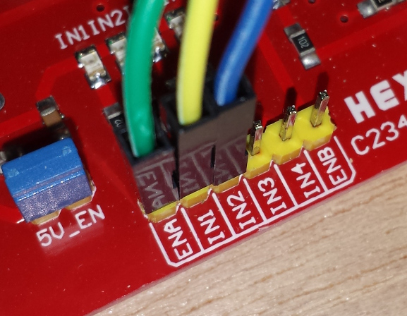
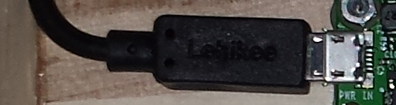
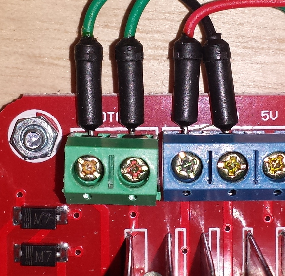
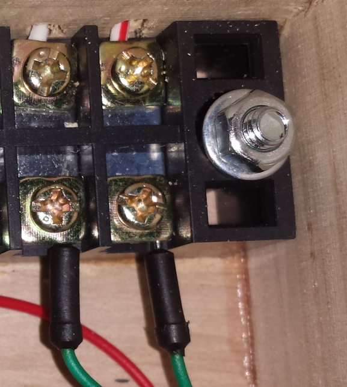
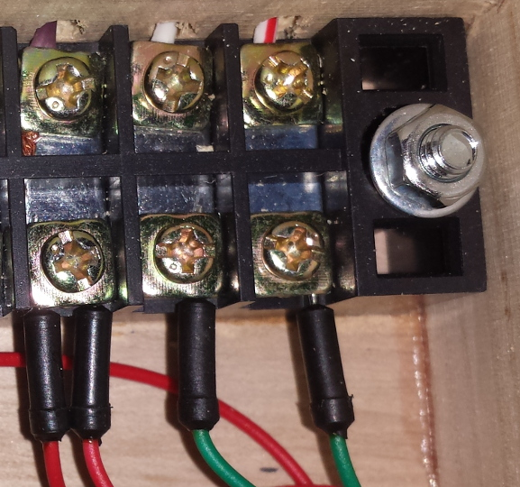
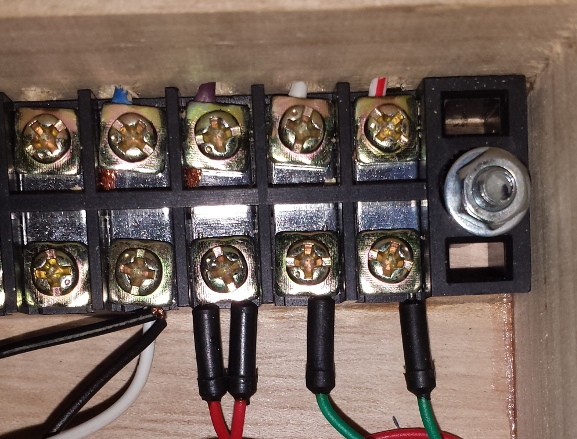

trainCap
========

Relatively easy to build experimental DCC train control from your smart phone's web-browser, powered by a Raspberry Pi.

This is experimental hardware and software. Please don't indulge unless you like to tinker/fix what I broke. This build is currently untested by other people, but any feedback is appreciated.

This build requires aproximately $100 worth of parts and $40 worth of tools. 

# Safety and Security
This is experimental hardware. Unplug power when not attended. Currently includes no protection against shorts.

This device listens on your local area network for network connections and should not be run on security-sensitive networks without taking further precautions. This device uses software which is not automatically updated and may allow other infected machines on your network to infect it using future security bugs.

This device uses the default Raspian username and password, so changing the password is advised.

# Required Materials
## Stuff I Assume You Have

* a pencil, preferably a mechanical pencil
* a drill
* 3/32nd inch diameter drillbit
* 9/64th inch diameter drillbit
* 1/8th inch flat-head, or similar, screwdriver bit (or 3mm for metric)
* \#0 philips-head, or similar, screwdriver bit
* the following screws, nuts, and washers, probably cheapest bought loose from a local hardware store
* a functioning wireless network setup with WPA2 Personal security
* a network port you can plug into temporarily during setup

## Buying Stuff
Total cost is about $140:

* buy the main electronic bits and bobs online [here is the list](http://www.amazon.com/lm/R329UIW7IAAXW0) ($132, all Prime Eligible)
* ...except the misc. nuts, screws, and washers, which you should buy loose from a local hardware store ($7). Go buy these while you are waiting for your stuff to show up.

Qty | Description      | Unit Cost
------------- |-------------| -----:
10  | m2 nut | 23c  
10  | m2 screw, 12mm long | 23c
8   | nylon washer, .312x.140x.125| 13c
2   | m4 screw, 25mm long | 33c
2   | m4 nut | 27c
2   | m4 washer | 9c

# The Build
## What We Are Building
This is what we are building.

There is also a DC power-brick (not pictured) that lives outside the box, comes in through a pair of holes, and plugs into the barrier strip. The micro-SD card in the Raspberry Pi is on the back and can't be seen, but it's there!

## Prepare the Raspberry Pi
### Prepare the micro-SD Card
Download [NOT DONE YET - coming soon](http://downloads.raspberrypi.org/raspbian_latest) and follow the instructions for either [Windows](http://www.raspberrypi.org/documentation/installation/installing-images/windows.md), [Mac](http://www.raspberrypi.org/documentation/installation/installing-images/mac.md), or [Linux](http://www.raspberrypi.org/documentation/installation/installing-images/linux.md) for writing the image to the micro-SD card. The card must be at least 16 gigabytes in size. I found it much easier to get the card to phyiscally fit properly into my adapter when I put the micro-SD card in the SD card adapter and plugged it into the SD slot insetad of plugging the micro-SD card directly into the micro-SD slot.

Software tinkerers who do not wish to use the prepared image and are willing to undergo the 8-hour build may instead wish to supply their own Raspian install and run the following comand as root:

    wget -O - https://raw.githubusercontent.com/robjcaskey/trainCap/master/bootstrap.sh | bash

### Boot the Raspberry Pi
Plug the micro-SD card in the Pi. The slot is small and on the back of the board near the edge. Press it in until you hear a tiny click. Pressing it again will release it, so don't do that.

Plug in the micro-USB power adapter and plug that adapter into the wall.

Plug the network cable in to your router. Make sure the USB wireless adapter is not plugged into the Pi at this point.

Visit the [capFinder](http://robjcaskey.github.io/trainCap/capFinder.html), plug the pi into a monitor, or use another network scanner on port 8080 to find the ip address of the Raspberry Pi.

Unplug the micro-USB power adapter from the wall.

### Plug in the Wireless Adapter
Plug in the Wireless Adapter into the Raspberry Pi.

## Misc. Prep Tasks
### Apply the Heat Sink to the LM296 Down-Step Board
When you open the bag you will find it comes with a heat sink loose in the bag. Peel and stick the heat sink onto the big black thingy on the board.
### Prepare the 5v Power Supply
Take the micro-usb end of the cable and cut the cable in half about 6 inches from the connector.

Strip back the black sheath approximately two inches. You can do this by gently rotating the cable within some scissors then pulling the sheath toward the end of the cable with your hand until the sheath pulls off, revealing the two wires inside. 

Gently pull the two wires apart, get it started with your fingernails or a tiny snip in the middle of the insulation, then pull apart to seperate the final two inches of the cable.

Strip about a quarter inch off of each of those two wires and twist the wires at the end to keep the wires within from fraying. 

Take the portion that plugs into the wall and discard or add it to your spare parts bin.

### Preparing the 12V Power Supply
Make this is not plugged into the wall at any point during this build unless otherwise noted!

When unplugged, tthis takes a few seconds to discharge, so make sure the light is completely off.

Cut the barrel plug off the end of the cable. Strip batch the sheath approximately three inches by scoring around. You can do this by gently rotating the cable within some scissors then pulling the sheath toward the end of the cable with your hand until the sheath pulls off, revealing the two wires inside.

Gently pull the two wires apart, get it started with your fingernails or a tiny snip in the middle of the insulation, then pull apart to seperate the final 3 inches of the cable.

Strip about a quarter inch off of each of those two wires and twist the wires at the end to keep the wires within from fraying. 

## Layout out the Components
###Rough Layout
Open the box with the latch facing you and the hinges facing away.

Lay out the barrier strip, Raspberry Pi, motor control board, and step down board in the box roughly as shown.

Please Note: the micro-usb power connector is just here to show the required turn radius, don't do anything with it yet. It doesn't actually get screwed into the barrier strip. And yes, I know your still has a wall plug on the end, that comes later in the instructions!

Things to check as you are laying out items in the box:

* barrier strip and red motor control board flush with right side of box
* enough room behind the barrier strip to visibly inspect wires
* step down board not blocking HDMI port on Raspberry Pi
* step down board, raspberry pi board, and motor control board all frontally aligned
* Raspberry Pi far enough to the right that the USB power conductor not strained from cord pushing against left side of box
* front space preserved for later additions like indicators and switches on top and front of box
 
### Mark Screw Holes in Bottom of Box
Get your mechanical pencil. Extend the pencil lead way out, stick it in the screw holes, and swirl to mark the screw holes for each of the three boards plus the barrier strip. Hold the boards flat while marking the holes.

### Mark Terminal Holes in Back of Box
Slide the barrier strip flush to the back right of the box. Draw a line at the top of each of the 12 terminals on the back inner wall of the box.

### Actually Drill
Remove everything from the box and drill each hole using the 3/32nd drill bit on all the holes, wiggling a bit to enlage it since it's not an exact fit for metric.

Also drill a hole in the center of each of the 12 lines marked on the back of the box.

Go back and use the 9/32nd drill bit to further enlarge the two holes for the barrier strip and hte 12 for the barrier strip's terminals.

Don't actually attach anything yet!

# Preparing the LM296 Down-Step Board

Take a red female-to-female jumper, cut the connector off one end, and stick a red male-to-male jumper into it to create a 9" long red jumper with a male end.

Take a blackfemale-to-female jumper, cut the connector off one end, and stick a black male-to-male jumper into it to create a 9" long black jumper with a male end.

Take the long red jumper we just made, strip a tiny bit of the wire, and solder it through IN+. 
Take the long black jumper we just made, strip a tiny bit of the wire, and solder it through IN-. 

Find an empty barrier strip terminal and attach the purple wire from the 12-volt power supply and the red wire from IN+.
Find an empty barrier strip terminal and attach the blue wire from the 12-volt power supply and the black wire from IN-.

Get your multimeter.
Plug the red probe into the VmA port and the black probe into COM.
Turn the multimeter on and dial it to DCV 200.
Plug the 19v power supply into the wall.
Put the black probe on VOUT- on the LM296
Put the red probe on VOUT+ on the LM296
Should read 19.5V or so.
Use a screwdriver to turn the screw on the blue part counter clock-wise a turn or two, then re-measure again. The voltage should have dropped. Keep turning the screw until the voltage reads 5.0
Unplug the 19v power supply.
Unplug the LM296 board from all terminals on the barrier strip.
Unplug the 19v power supply from all terminals on the barrier strip.

Take the red cable from the micro-usb plug, strip a tiny bit of the wire, and solder it through OUT+.
Take the black cable from the micro-usb plug, strip a tiny bit of the wire, and solder it through OUT-.

# Screw Stuff Down
Put the barrier strip in the box. Put the two M4 screws through the bottom of the box, put the barrier strip on the screws, put the M4 washers on top, and then secure it by hand-tightening the M4 nut.
Put four M2 screws through the bottom of the box where the Raspberry Pi will reside, put an M2 nylon washer on top of each screw, place the Pi on the screws, place a M2 nut on top of each screw, and then hand-tighten.
Put four M2 screws through the bottom of the box where the motor control board will reside, put an M2 nylon washer on top of each screw, place the Motor Control Board on the screws, place a M2 nut on top of each screw, and then hand-tighten.
Put two M2 screws through the bottom of the box where the Down-Step Board will reside, put an M2 nylon washer on top of each screw, place the Down-Step Board on the screws, place a M2 nut on top of each screw, and then hand-tighten.

Peel and stick the feet on the bottom of the box.
# Hooking it Up
Re-verify the power supply is unplugged from the wall.

Put the two wires from the track and the two wires through the holes in the box and screw down into the barrier strip as pictured below.

Get green, yellow, blue, and white female-to-female jumpers and plug them into the Raspberry Pi as pictured below.

The other end of the white jumper will remain loose for now but let's go ahead and take the other ends of the green, yellow, and blue jumpers and plug them into the motor control board as shown.

Plug the micro usb plug into Raspberry Pi. The wires in the other end will get plugged in later.

Plug and screw-down the red, red, blue, and black pins as pictured into the Raspberry pi. 

The red and black wires jumpers will remain loose for now but let's go ahead and take the green wires and screw them into the barrier strip as shown.

Take one of the green wires from the motor control board and put it in the first barrier strip terminal on the right.
Take the other green wire from the motor control board and put it in the second barrier strip terminal from the right.

Locate the long red jumper attached to IN+ from the voltage step-down board into a female red jumper. Double-check that you indeed have the IN+ since there is anothe red wire on that board. Pair it with the red wire from the motor control board, and screw them both into the third barrier strip terminal from the right as shown.

Take the loose end of the black jumper from the motor control board, the white jumper from the raspberry pi, and the black IN- from the voltage step-down board, cut the end off all three wires and strip them about a quarter of an inch. Twist all three together and screw them into the fourth barrier strip terminal from the right.

# To-Da!

